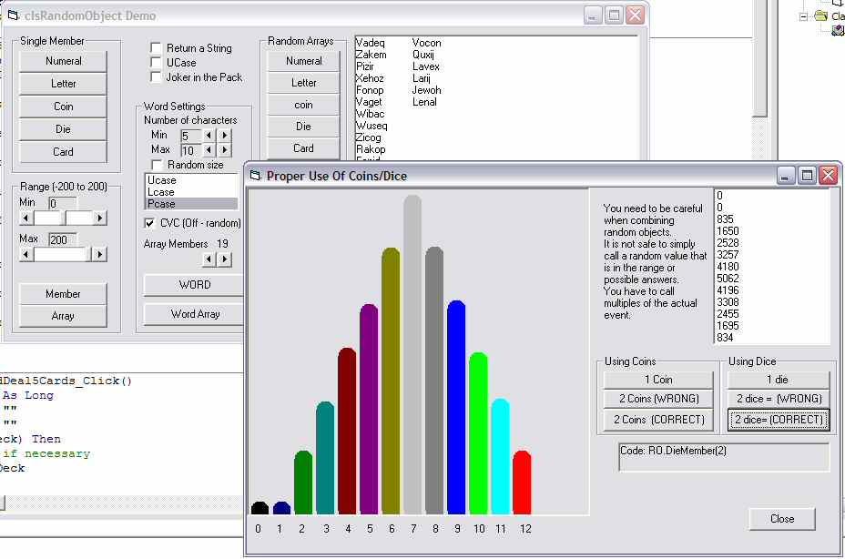



## clsRandomObject

### Description

This class simulates several common random objects (coins/dice/cards) and provides the ability to extract either a single member of a random range or an array containing a shuffled array of the full range of the object. Also supports random letters, vowels & consonents(standard English only), numerals(0-9), RndWords or user created ranges. Please let me know if you extend the letters to cope with other languages.
 
### More Info
 

             |
---                |---
**Submitted On**   |2004-09-01 02:01:02
**By**             |[Roger Gilchrist](https://github.com/Planet-Source-Code/PSCIndex/blob/master/ByAuthor/roger-gilchrist.md)
**Level**          |Intermediate
**User Rating**    |3.7 (11 globes from 3 users)
**Compatibility**  |VB 6\.0
**Category**       |[Miscellaneous](https://github.com/Planet-Source-Code/PSCIndex/blob/master/ByCategory/miscellaneous__1-1.md)
**World**          |[Visual Basic](https://github.com/Planet-Source-Code/PSCIndex/blob/master/ByWorld/visual-basic.md)
**Archive File**   |[clsRandomO178820912004\.zip](https://github.com/Planet-Source-Code/roger-gilchrist-clsrandomobject__1-55937/archive/master.zip)

